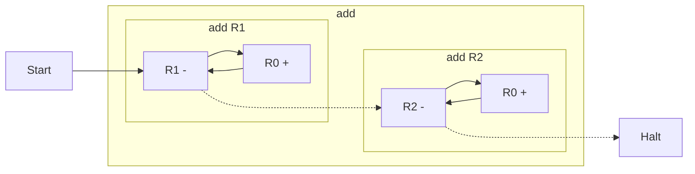

# Program Graphs

For all but the simplest register machine programs, understanding their workings is very difficult just from reading the instructions. Instead, we can make graphs of the programs to more clearly illustrate their workings.

The graph just needs to represent the operations performed in registers. As such, instruction labels will not appear in the graph. Instead, nodes will represent the instruction bodies, with arrows used to illustrate the jumping between instructions. Solid arrows $\rightarrow$ will be used to show the normal progression, that is, jumps after an increment or successful decrement. Dashed arrows $\dashrightarrow$ will be used to show the progression in the case of failure on a decrement. An additional $Start$ node will be included to highlight the start point of the program.

## Examples

We will now create graphs for some of the programs from the [examples](../examples/programs.md).

### Adder

